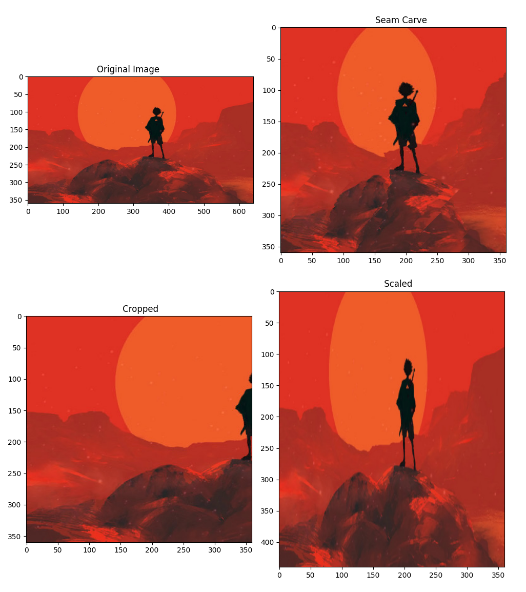

# seam-carve
 Content-Aware Image Resizing implemented based on "Seam Carving for Content-Aware Image Resizing" paper written by Shai Avidan and Ariel Shamir.  
 Reference Paper: https://inst.eecs.berkeley.edu//~cs194-26/fa15/hw/proj4-seamcarving/imret.pdf  
 
 Project created as a part of Introduction to Image Understanding course.  
 
 Code and examples can be found in seam_carve.ipynb notebook.

# Demo

